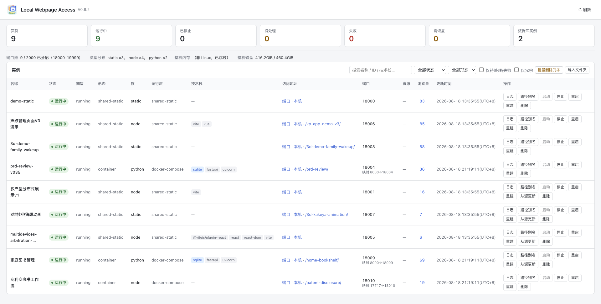

<h1>
  
  Local Webpage Access (<code>lwa</code>)
</h1>

A mini platform for deploying web projects on a LAN. Import a zip (or a local folder); LWA detects the stack, assigns a port, and gives you a LAN URL.

**English** · [中文](#中文文档)

| English | 中文 |
| --- | --- |
| [Overview](#overview) · [Features](#features) · [Install](#installation) · [Platforms](#supported-platforms) · [Quick start](#quick-start) | [简介](#简介) · [特性](#特性) · [安装](#安装) · [平台](#支持的平台) · [快速开始](#快速开始) |
| [Commands](#command-reference) · [Config](#configuration) · [Layout](#workspace-layout) · [Manager](#web-manager) | [命令](#命令参考) · [配置](#配置) · [布局](#工作区布局) · [管理页](#管理页) |
| [Daemon](#auto-import-daemon) · [Develop](#development-and-testing) · [Docs](#documentation) · [Roadmap](#roadmap) | [守护进程](#自动导入守护进程) · [开发](#开发与测试) · [文档](#文档) · [路线图](#路线图) |

---

## Overview

Built for 4–8 GB home servers: **import and it runs**.

- Pure static HTML → shared static gateway (Caddy, with built-in `http.server` as fallback)
- Frontend SPA (Vite / React / Vue / Svelte, …) → `npm install` + `build`, then serve the output
- Node / Python backends and SQLite full-stack apps → generated Dockerfile + Compose, run in containers

CLI, web manager, inbox auto-import, import-time security checks, and `lwa doctor` are all in V1. Details live in [docs/](docs/faq.md); this page is the on-ramp.



## Features

- **Import a zip, a local folder, or drop files into `inbox/`** — zip-slip protection, content fingerprints, read-only copy into the workspace (never run from your source tree).
- **Detects how to run it** — `static` / Node / Python, with or without SQLite; unknown projects stay `pending` until you rescan.
- **Port pool + optional path aliases** — stable `lanUrl`; `/{slug}/` via Caddy, refused if the SPA’s absolute paths would break. Alias entries inject `X-Real-IP` for the backend.
- **Static and container hosting** — Caddy or builtin for static; generated non-root Dockerfile/Compose with SQLite `data/` mounts for apps. Optional manifest `buildHooks` / `preStart` hooks (issue #7).
- **Lifecycle on a small host** — start / stop / recover / rebuild / cancel-build; default build concurrency 1; instance ports stay put. `rebuild` warns when the linked folder/git source has drifted (`--sync` refreshes it first; doctor `source_freshness` audits all instances).
- **Web manager + inbox daemon** — Vue UI on `:17800` (loopback reads are token-free; LAN needs a rotating token). The daemon imports zips and heals dropped lightweight instances.
- **Won’t silently write dangerous images** — generated Compose/Dockerfile audited before write; zip traversal / symlinks / bombs rejected.
- **`lwa doctor` does not fake green** — Python / Docker / Compose / ports / disk, plus service runtime and autostart resilience. `--json` works even before `init`.
- **Host setup and autostart** — Docker/Caddy install scripts (China mirrors by default); launchd / systemd units; Ubuntu LTS, Debian Stable, WSL2, macOS only.
- **Move the workspace, update LWA, talk to an agent** — `lwa workspace relocate`, `lwa update` (fast-forward only), 20 SKILL.md files for AI assistants.

## Installation

Python 3.13+, **fastapi ≥ 0.138.0**, **uvicorn ≥ 0.45.0**. Containers need **Docker ≥ 29.0.0** and **Docker Compose ≥ 2.40.2** (5.2+ recommended). Static sites prefer **Caddy ≥ 2.10.0**. Image baselines: `node:24-alpine`, `python:3.13-slim`. `lwa doctor` checks all of this.

```bash
pip install -e .              # from the repo root; also: python3 -m local_webpage_access
pip install -e ".[dev]"       # tests
lwa setup                     # detect host tools (no workspace required)
lwa init                      # then: lwa init --full --yes  for the Full capability loop
```

If joining the `docker` group still reports `sessionRefreshRequired`, re-login and run `lwa setup --full --resume`. See the [FAQ](docs/faq.md) and [operations playbook](docs/operations-playbook.md).

## Supported Platforms

- **Linux**: Ubuntu LTS (22.04 / 24.04 / 26.04) and Debian Stable (12 / 13); x86_64 / arm64; kernel ≥ 5.15, glibc ≥ 2.35, systemd
- **WSL2**: same distros; WSL ≥ 2.1.5 with systemd as PID 1; keep the workspace on the Linux filesystem (autostart fail-closes on `/mnt/<drive>`). See [WSL2 host prep](docs/known-limitations.md)
- **macOS**: 14 Sonoma+
- **Not supported**: native Windows (use WSL2), WSL1, non-LTS Ubuntu, Debian sid/testing

`lwa doctor` always prints a platform-support section; `lwa doctor --json` works before `init`.

## Quick Start

```bash
lwa setup
lwa init
lwa import ./inbox/my-site.zip --name my-site
lwa start my-site
lwa status
```

That is the whole happy path. Folder import: `lwa import --from-dir /abs/path`; GitHub import: `lwa import --from-git https://github.com/<owner>/<repo>`. Optional next steps (`manager on`, `daemon on`, `gateway on`, `autostart install`, `doctor`) are in the [command reference](#command-reference).

## Command Reference

Use `lwa <command> --help` for flags. Global `-v` turns on DEBUG logs.

### Install and workspace

| Command | Description |
| --- | --- |
| `lwa setup [--default\|--full] [--yes] [--resume] [--script] [--json] [--autostart] [--with-caddy]` | Detect host tools; `--full` installs and runs the capability loop |
| `lwa init [-w DIR] [--force] [--default\|--full] [--yes]` | Create workspace (dirs / config / registry / skills); `--full` writes `profile: full` only when the loop is ready |
| `lwa update` | Update LWA itself (fetch → fast-forward → pip). Refuses dirty, diverged, detached, or shallow trees |
| `lwa workspace relocate <NEW> [--dry-run] [--yes] [--resume\|--verify\|--rollback]` | Same-volume atomic move. See [workspace-rename.md](docs/workspace-rename.md) |
| `lwa version` | Print version |

### Import

| Command | Description |
| --- | --- |
| `lwa import <zip> [-n NAME] [--path-alias SLUG] [--update ID]` | Import a zip; `--update` upgrades in place (keeps id / ports / data / alias) |
| `lwa import --from-dir <ABS> [-n NAME] [--path-alias SLUG] [--update ID]` | Import or update from a local folder (read-only copy; `--update` path must match the linked dir) |
| `lwa import --from-git <URL> [--ref REF] [--subdir DIR] [-n NAME] [--path-alias SLUG] [--update ID]` | Import or update from a GitHub repo (github.com only; one-shot shallow clone into temp staging, then same zip pipeline; `--update` probes via `git ls-remote` and no-ops when OID unchanged) |
| `lwa alias set <ID> <slug>` / `lwa alias clear <ID>` | Path alias (needs Caddy; compatibility-checked) |
| `lwa scan [ID]` | Rescan `pending` instances (or one id) |

### Instance lifecycle

| Command | Description |
| --- | --- |
| `lwa start` / `stop` / `restart` `<ID>` | Start, stop, or restart (containers reuse the registered port) |
| `lwa recover <ID>` | One-shot recovery (pulls Caddy up if needed, then restart) |
| `lwa rebuild [--sync] <ID>` | Force-rebuild through the build queue; `--sync` refreshes folder/git sources first (stale sources are detected and warned) |
| `lwa cancel-build <ID>` | Cancel a queued or running build (keeps caches / images / data) |
| `lwa remove <ID> [--purge] [--force]` | Remove instance; `--purge` deletes disk (non-empty `data/` needs `--force`) |
| `lwa remove --redundant [--purge]` | Drop duplicate zips, keep the earliest |
| `lwa logs <ID> [-c CATEGORY] [-n TAIL]` | Logs: build / run / gateway / import / scan |
| `lwa status [ID]` / `lwa list` | Status of one or all; list ids and ports |
| `lwa stats [ID]` | Host + instance disk / image / container usage |
| `lwa pageviews [ID] [-n LIMIT]` | Pageview summary (same data as the manager) |

### Gateway, manager, and access

| Command | Description |
| --- | --- |
| `lwa gateway on` / `off` / `status` | Caddy master (`:8080` aliases, admin `:2019`) |
| `lwa gateway switch <caddy\|builtin> [--dry-run] [--json] [--no-review]` | Atomic backend switch with rollback |
| `lwa access refresh` | Recompute `lanUrl` from the current LAN IP |
| `lwa access review [--json] [--rebuild-if-needed]` | Probe declared URLs (blank alias pages, API-path mismatch) |
| `lwa manager on` / `off` / `status` / `start` / `logs` | Web UI (`:17800`); `start` is foreground |
| `lwa manager token [--json]` | Show token, issued-at, next rotation (168h) |
| `lwa daemon on` / `off` / `status` | Watch `inbox/`; import and self-heal |

### Autostart

| Command | Description |
| --- | --- |
| `lwa autostart install [--with-caddy] [--no-enable] [--linger]` | Write launchd / systemd units (enabled by default) |
| `lwa autostart enable` / `disable` / `status` | Load, persistently disable, or inspect |
| `lwa autostart check [--json]` | Deep completeness check |
| `lwa autostart repair [--with-caddy]` | Fix stale paths and re-enable |
| `lwa autostart uninstall [--purge-linger]` | Stop units and delete files (workspace kept) |
| `lwa autostart doctor-hints` | Autostart-related doctor copy |

### Diagnostics

| Command | Description |
| --- | --- |
| `lwa doctor [ID] [--json] [--profile default\|full] [--access]` | Environment / instance checks; exit 1 on fail. `--access` reviews URLs |
| `lwa capabilities [--json]` | Workspace CapabilityReport |
| `lwa registry check [--json]` | Scan registry sub-tables for orphan rows (read-only, BUG-473) |
| `lwa registry repair [-y]` | Delete orphan rows (destructive; interactive confirm, `--yes` required non-TTY) |

## Configuration

`lwa init` writes `local-web.yml`. Important keys:

```yaml
managerPort: 17800          # must not sit inside the port pool
managerHost: 0.0.0.0
portPool: { start: 18000, end: 19999 }
staticGateway: caddy        # caddy | builtin
staticGatewayPort: 8080     # alias entry (Caddy)
profile: default            # default | full
serviceUser: null           # identity pinned by Full setup
buildConcurrency: 1
defaultResourceLimits: { memory: 512m, cpus: "0.75" }
buildMirrors: { enabled: true, preset: china }
lanIpStrategy: auto         # auto | manual
manualLanIp: null
logLevel: INFO
```

## Workspace Layout

```
<workspace>/
├─ local-web.yml            # config
├─ inbox/                   # drop zips here (processed/ / failed/)
├─ apps/<id>/               # current/, public/, data/, docker/, logs/, local-web.json
├─ registry/                # local-web.db + build-locks.db
├─ static-gateway/          # sites/ + aliases/
├─ run/                     # pid, token, pageviews, capability snapshots
├─ logs/                    # lwa.log, manager.log, daemon.log, gateway.log
├─ templates/  manager/  skills/
```

## Web Manager

```bash
lwa manager on          # http://127.0.0.1:17800/  — token printed once; loopback reads need none
```

Instance list, logs, resources, start/stop/recover, aliases, pageviews, pending queue, port pool. LAN clients need the current token (`lwa manager token`). Native “choose folder” is loopback-only. Full API: [docs/manager-page.md](docs/manager-page.md).

## Auto-import Daemon

`lwa daemon on` watches `inbox/`, imports zips, and starts lightweight instances it can determine. Every 60s it reconciles `desired=running` processes that died. It will not auto-correct containers when observation fails or Full capabilities are not ready.

## Development and Testing

```bash
pip install -e ".[dev]"
python3 -m pytest           # no real Docker required
```

Code: `src/local_webpage_access/`. Tests: `tests/` (fake runtimes; set `LWA_RUN_DOCKER_TESTS=1` for real Docker — [testing.md](docs/testing.md)). Fixtures in `tests/fixtures/`.

## Documentation

| Doc | Contents |
| --- | --- |
| [docs/faq.md](docs/faq.md) | Troubleshooting (symptom → log) |
| [docs/operations-playbook.md](docs/operations-playbook.md) | Day-2 ops: setup, logs, gateway, inbox, Caddy |
| [docs/manager-page.md](docs/manager-page.md) | Manager API and auth |
| [docs/autostart.md](docs/autostart.md) | launchd / systemd |
| [docs/runtime-workspace.md](docs/runtime-workspace.md) | Directories, ports, resource tiers |
| [docs/workspace-rename.md](docs/workspace-rename.md) | Relocate handbook |
| [docs/security-boundary.md](docs/security-boundary.md) | Default protections |
| [docs/known-limitations.md](docs/known-limitations.md) | Limits + WSL2 host prep |
| [docs/testing.md](docs/testing.md) | How tests run |
| [docs/release-checklist.md](docs/release-checklist.md) / [acceptance-checklist.md](docs/acceptance-checklist.md) | Release / E2E |
| [skills/README.md](src/local_webpage_access/skills/README.md) | 20 LLM skills |

## Roadmap

Phases 0–7 (CLI → import → static → containers → lifecycle → manager/daemon → skills/security/doctor → tests/release) are **done**. Maintainer log: `task-list.md`.

## License

MIT

---

# 中文文档

[English](#overview) · **中文**

## 简介

面向局域网小主机的**本地网页部署基座**：导入 zip（或本机文件夹），自动识别运行形态、分配端口、给出局域网地址。面向 4G/8G 机器，目标是**导入即用**。

- 纯静态 HTML → 共享静态网关（Caddy 优先，内置 `http.server` 兜底）
- 纯前端 SPA（Vite / React / Vue / Svelte 等）→ 自动 `npm install` + `build` 后托管产物
- Node / Python 后端、含 SQLite 的全栈 → 生成 Dockerfile + Compose，容器运行

CLI、管理页、inbox 自动导入、导入期安全检查、`lwa doctor` 均已在 V1。细节在 [docs/](docs/faq.md)，本页只做入口。


## 特性

- **zip、本机文件夹、或丢进 `inbox/`** — zip-slip 防护、内容指纹；只读复制进工作区，禁止在你的源码树里就地运行。
- **自动识别运行形态** — `static` / Node / Python，是否带 SQLite；认不出的标 `pending`，可再 `scan`。
- **端口池 + 可选路径别名** — `lanUrl` 稳定；Caddy 下 `/{slug}/`，SPA 绝对路径会打坏时直接拒绝。 别名入口为后端注入 `X-Real-IP`。
- **静态与容器托管** — 静态走 Caddy 或内置服务；应用生成非 root Dockerfile/Compose，SQLite 挂 `data/`。 支持 manifest 声明式 `buildHooks` / `preStart` 构建钩子（issue #7）。
- **小主机上的生命周期** — start / stop / recover / rebuild / cancel-build；默认构建并发 1；端口不漂移。 `rebuild` 检出关联 folder/git 源码漂移时警告（`--sync` 先同步再重建；doctor `source_freshness` 批量审计）。
- **管理页 + inbox 守护进程** — `:17800` 的 Vue 界面（本机读免 token，局域网用自动轮换的 token）。daemon 导入 zip 并拉起掉线的轻量实例。
- **危险镜像不会默写出** — 生成的 Compose/Dockerfile 写出前审计；zip 穿越 / 符号链接 / 炸弹拒绝导入。
- **`lwa doctor` 不假绿** — Python / Docker / Compose / 端口 / 磁盘，以及服务是否在跑、自启是否装好。未 `init` 也可用 `--json`。
- **宿主机装配与自启** — Docker/Caddy 安装脚本（默认国内源）；launchd / systemd；仅 Ubuntu LTS、Debian Stable、WSL2、macOS。
- **搬工作区、升级 LWA、交给 Agent** — `lwa workspace relocate`、`lwa update`（只允许快进）、20 份 SKILL.md。

## 安装

需要 Python 3.13+、**fastapi ≥ 0.138.0**、**uvicorn ≥ 0.45.0**。容器需要 **Docker ≥ 29.0.0**、**Docker Compose ≥ 2.40.2**（推荐 5.2+）。静态站优先 **Caddy ≥ 2.10.0**。基线镜像：`node:24-alpine`、`python:3.13-slim`。用 `lwa doctor` 逐项核对。

```bash
pip install -e .              # 在仓库根目录；也可用 python3 -m local_webpage_access
pip install -e ".[dev]"       # 跑测试
lwa setup                     # 检测宿主机工具（无需工作区）
lwa init                      # Full 能力闭环：lwa init --full --yes
```

加入 `docker` 组后若仍报 `sessionRefreshRequired`，重登再执行 `lwa setup --full --resume`。见 [排障](docs/faq.md) 与 [运维手册](docs/operations-playbook.md)。

## 支持的平台

- **Linux**：Ubuntu LTS（22.04 / 24.04 / 26.04）与 Debian Stable（12 / 13）；x86_64 / arm64；kernel ≥ 5.15、glibc ≥ 2.35、systemd
- **WSL2**：同上发行版；WSL ≥ 2.1.5 且 systemd 为 PID 1；工作区放 Linux 文件系统（autostart 对 `/mnt/<drive>` 直接失败）。见 [WSL2 宿主准备](docs/known-limitations.md)
- **macOS**：14 Sonoma+
- **不支持**：Windows 原生（请用 WSL2）、WSL1、Ubuntu 非 LTS、Debian sid/testing

`lwa doctor` 末尾有「平台支持」段；未初始化时用 `lwa doctor --json`。

## 快速开始

```bash
lwa setup
lwa init
lwa import ./inbox/my-site.zip --name my-site
lwa start my-site
lwa status
```

这就是主路径。文件夹导入：`lwa import --from-dir /abs/path`；GitHub 导入：`lwa import --from-git https://github.com/<owner>/<repo>`。管理页、daemon、网关、自启、`doctor` 等可选步骤见 [命令参考](#命令参考)。

## 命令参考

细节用 `lwa <command> --help`。全局 `-v` 打开 DEBUG。

### 安装与工作区

| 命令 | 说明 |
| --- | --- |
| `lwa setup [--default\|--full] [--yes] [--resume] [--script] [--json] [--autostart] [--with-caddy]` | 检测宿主机工具；`--full` 安装并做能力闭环 |
| `lwa init [-w DIR] [--force] [--default\|--full] [--yes]` | 初始化工作区；`--full` 仅在闭环 ready 后写入 `profile: full` |
| `lwa update` | 升级 LWA 自身（fetch → 快进 → pip）。工作区脏、分叉、detached、浅克隆会拒绝 |
| `lwa workspace relocate <NEW> [--dry-run] [--yes] [--resume\|--verify\|--rollback]` | 同卷原子迁移，见 [workspace-rename.md](docs/workspace-rename.md) |
| `lwa version` | 版本号 |

### 导入

| 命令 | 说明 |
| --- | --- |
| `lwa import <zip> [-n NAME] [--path-alias SLUG] [--update ID]` | 导入 zip；`--update` 原地升级（保留 id / 端口 / data / 别名） |
| `lwa import --from-dir <ABS> [-n NAME] [--path-alias SLUG] [--update ID]` | 本机文件夹导入/更新（只读复制；`--update` 路径须与关联目录一致） |
| `lwa import --from-git <URL> [--ref REF] [--subdir DIR] [-n NAME] [--path-alias SLUG] [--update ID]` | 从 GitHub 仓库导入/更新（仅 github.com；一次性浅克隆到临时暂存后走同一 zip 管线；`--update` 经 `git ls-remote` 探测，OID 未变则不做任何操作） |
| `lwa alias set <ID> <slug>` / `lwa alias clear <ID>` | 路径别名（需 Caddy；不兼容则拒绝） |
| `lwa scan [ID]` | 重扫 `pending`（或指定实例） |

### 实例生命周期

| 命令 | 说明 |
| --- | --- |
| `lwa start` / `stop` / `restart` `<ID>` | 启动、停止、重启（容器复用已登记端口） |
| `lwa recover <ID>` | 一键恢复（必要时先拉起 Caddy） |
| `lwa rebuild [--sync] <ID>` | 经构建队列强制重建；`--sync` 先同步 folder/git 源码（漂移时自动警告） |
| `lwa cancel-build <ID>` | 取消排队/进行中的构建（不删缓存/镜像/数据） |
| `lwa remove <ID> [--purge] [--force]` | 移除实例；`--purge` 删磁盘（非空 `data/` 需 `--force`） |
| `lwa remove --redundant [--purge]` | 按 zip 指纹去重，保留最早者 |
| `lwa logs <ID> [-c CATEGORY] [-n TAIL]` | 日志：build / run / gateway / import / scan |
| `lwa status [ID]` / `lwa list` | 状态；列出 id 与端口 |
| `lwa stats [ID]` | 整机 + 实例磁盘/镜像/容器占用 |
| `lwa pageviews [ID] [-n LIMIT]` | 浏览量（与管理页同一数据） |

### 网关、管理页与访问

| 命令 | 说明 |
| --- | --- |
| `lwa gateway on` / `off` / `status` | Caddy master（`:8080` 别名，admin `:2019`） |
| `lwa gateway switch <caddy\|builtin> [--dry-run] [--json] [--no-review]` | 原子切换后端，失败回滚 |
| `lwa access refresh` | 按当前 LAN IP 重算 `lanUrl` |
| `lwa access review [--json] [--rebuild-if-needed]` | 探活声明的 URL（别名白屏、API 路径错位） |
| `lwa manager on` / `off` / `status` / `start` / `logs` | 管理页（`:17800`）；`start` 为前台 |
| `lwa manager token [--json]` | 查看 token、颁发时间、下次轮换（168h） |
| `lwa daemon on` / `off` / `status` | 监听 `inbox/`，导入并自愈 |

### 自启

| 命令 | 说明 |
| --- | --- |
| `lwa autostart install [--with-caddy] [--no-enable] [--linger]` | 写入 launchd / systemd 单元（默认启用） |
| `lwa autostart enable` / `disable` / `status` | 加载、持久停用、查看 |
| `lwa autostart check [--json]` | 完备性深检 |
| `lwa autostart repair [--with-caddy]` | 修复失效路径并重新启用 |
| `lwa autostart uninstall [--purge-linger]` | 停单元、删文件（工作区保留） |
| `lwa autostart doctor-hints` | 自启相关 doctor 文案 |

### 诊断

| 命令 | 说明 |
| --- | --- |
| `lwa doctor [ID] [--json] [--profile default\|full] [--access]` | 环境/实例检查；有 fail 则退出码 1。`--access` 复核 URL |
| `lwa capabilities [--json]` | 工作区 CapabilityReport |
| `lwa registry check [--json]` | 只读扫描 registry 子表孤儿行（BUG-473） |
| `lwa registry repair [-y]` | 删除孤儿行（破坏性；默认交互确认，非 TTY 须 `--yes`） |

## 配置

`lwa init` 生成 `local-web.yml`，关键字段：

```yaml
managerPort: 17800          # 不能落在端口池内
managerHost: 0.0.0.0
portPool: { start: 18000, end: 19999 }
staticGateway: caddy        # caddy | builtin
staticGatewayPort: 8080     # 别名入口（Caddy）
profile: default            # default | full
serviceUser: null           # Full 固化的运行身份
buildConcurrency: 1
defaultResourceLimits: { memory: 512m, cpus: "0.75" }
buildMirrors: { enabled: true, preset: china }
lanIpStrategy: auto         # auto | manual
manualLanIp: null
logLevel: INFO
```

## 工作区布局

```
<workspace>/
├─ local-web.yml            # 配置
├─ inbox/                   # 投放 zip（processed/ / failed/）
├─ apps/<id>/               # current/、public/、data/、docker/、logs/、local-web.json
├─ registry/                # local-web.db + build-locks.db
├─ static-gateway/          # sites/ + aliases/
├─ run/                     # pid、token、pageviews、能力快照
├─ logs/                    # lwa.log、manager.log、daemon.log、gateway.log
├─ templates/  manager/  skills/
```

## 管理页

```bash
lwa manager on          # http://127.0.0.1:17800/  — token 只打一次；本机读请求免 token
```

实例列表、日志、资源、启停/恢复、别名、浏览量、pending 队列、端口池。局域网访问需要当前 token（`lwa manager token`）。「选择文件夹」仅 loopback。API 见 [docs/manager-page.md](docs/manager-page.md)。

## 自动导入守护进程

`lwa daemon on` 监听 `inbox/`，导入 zip，并启动能确定的轻量实例。每 60s 调和 `desired=running` 但已掉线的进程。观测失败或 Full 能力未就绪时，**不会**自动纠正容器。

## 开发与测试

```bash
pip install -e ".[dev]"
python3 -m pytest           # 不依赖真实 Docker
```

代码在 `src/local_webpage_access/`，测试在 `tests/`（替身运行时；真实 Docker 设 `LWA_RUN_DOCKER_TESTS=1`，见 [testing.md](docs/testing.md)）。夹具在 `tests/fixtures/`。

## 文档

| 文档 | 内容 |
| --- | --- |
| [docs/faq.md](docs/faq.md) | 排障（症状 → 日志） |
| [docs/operations-playbook.md](docs/operations-playbook.md) | 日常运维：装配、日志、网关、inbox、Caddy |
| [docs/manager-page.md](docs/manager-page.md) | 管理页 API 与鉴权 |
| [docs/autostart.md](docs/autostart.md) | launchd / systemd |
| [docs/runtime-workspace.md](docs/runtime-workspace.md) | 目录、端口、资源档位 |
| [docs/workspace-rename.md](docs/workspace-rename.md) | 迁移手册 |
| [docs/security-boundary.md](docs/security-boundary.md) | 默认保护 |
| [docs/known-limitations.md](docs/known-limitations.md) | 已知限制 + WSL2 宿主准备 |
| [docs/testing.md](docs/testing.md) | 如何跑测试 |
| [docs/release-checklist.md](docs/release-checklist.md) / [acceptance-checklist.md](docs/acceptance-checklist.md) | 发布 / 端到端 |
| [skills/README.md](src/local_webpage_access/skills/README.md) | 20 个 LLM Skill |

## 路线图

Phase 0–7（CLI → 导入 → 静态 → 容器 → 生命周期 → 管理页/daemon → Skills/安全/doctor → 测试/发布）均**已完成**。维护台账见 `task-list.md`。

## 许可

MIT
