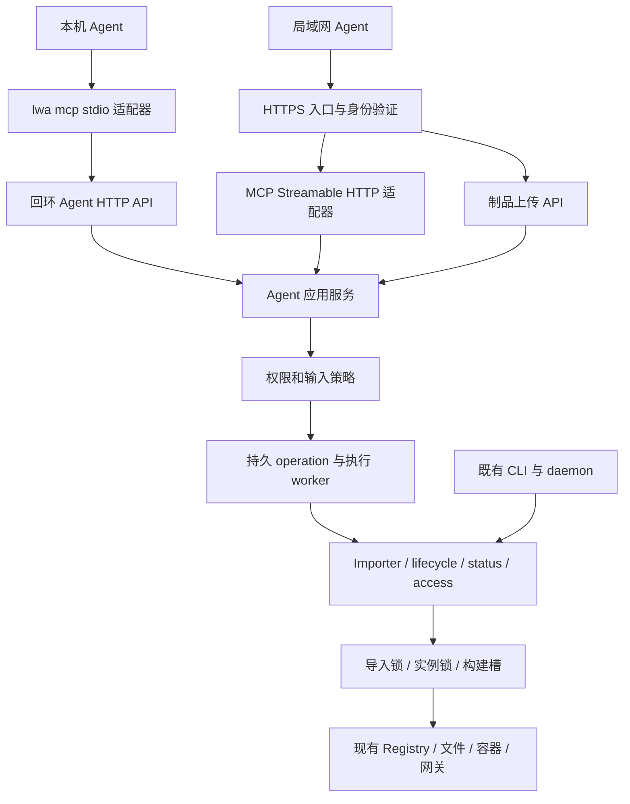

# LWA 智能体接入与协作：架构、服务、功能及 WBS

**状态：设计提案，待评审；本文完成不代表功能已实现。**

**目标：**让本机和同局域网的 Agent 在获得明确授权后，找到既有 LWA、理解部署约束、交付项目、查询结果，并在重试和并发时保持操作可追踪。

**架构：**保留现有 Runtime，以 manager 为 Agent 请求的统一受理入口，新增协议无关的 Agent 应用服务。stdio 作为连接既有 manager 的适配器；远程 MCP 使用 Streamable HTTP，复用同一应用服务与底层生命周期能力。

**技术栈：**现有 Python >=3.13、FastAPI、Pydantic、SQLite、httpx；新增可选官方 MCP Python SDK。具体 SDK 版本由兼容性验证后锁定。

**读者：**维护者、实施 Agent、评审者。正式接入指南在实施阶段发布到 `docs/`；本文属于内部设计，保存于 `design/3-plans/`。

**调研基线：**2026-09-15；仓库 HEAD `316ce9c`（V0.8.14-Build3728-20260914），结合当前工作树只读检查。没有对运行中的服务进行部署、鉴权或局域网连通性验证。本文所有新命令、端点、结构与参数均为拟议契约。

## 1. 对原评估报告的判断

总体方向正确：已经具备较完整的执行能力，确实适合提供 MCP。但“做几层函数包装，成本不高”只适用于原型，不能覆盖稳定的多 Agent 协作。应分清四件事：**找到服务、理解能力、获得权限、可靠执行**。

### 1.1 当前代码核实

| 原报告判断 | 核实结果与修正 | 代码依据（相对仓库根目录） |
| --- | --- | --- |
| 有 20 个 LLM skills | 属实，实际存在 20 个 SKILL.md；包含 pending 修复流程与最多两轮修复后转人工的指导 | `src/local_webpage_access/skills/README.md`、同目录各 skill |
| HTTP API 除 health 外全部要求 token | 路由声明如此，但实际依赖有例外：符合回环地址和 Host 条件的安全方法免 token；同源回环写请求也可免 token；普通无 token 脚本写请求可能得到 403 | `manager_api.py:require_token`、`_is_localhost_client` |
| 可复用现有 token | 管理 token 是共享管理权限，有原子轮换与 0600 文件保护；没有按 Agent 身份划分的 scope、实例归属与审计授权模型 | `manager_api.py:ensure_token`、`rotate_token`、`_write_token` |
| 提供通用 Git 导入 | 目前精确允许 HTTPS `github.com`，不是任意 Git 主机；拒绝 URL userinfo 等，不应承诺任意私有 Git 或 SSH | `git_source.py:parse_github_url`、`ALLOWED_GIT_HOSTS` |
| HTTP 适合远程目录部署 | `sourceDir` 指服务器目录，不能读取远程 Agent 机器上的目录；现有 API 导入函数没有文件字节上传接口 | `manager_api.py:import_from_dir_op`、`import_from_git_op` |
| 已有异步与并发基础 | 已有跨进程构建槽、实例锁、导入活动锁、构建取消状态与进程身份持久化；需要补全的是面向请求的 operation 与幂等语义 | `build_queue.py`、`lifecycle.py:instance_lock`、`import_activity.py` |
| 默认 OpenAPI 可公开读取 | FastAPI 初始化未关闭默认文档，也没有在此应用层给文档加全局鉴权；属源码结论，实际网络入口仍受部署配置影响 | `manager_api.py:create_app` 内 FastAPI 初始化与路由挂载 |
| 没有 MCP 或发现入口 | 在检查的 `src/`、`docs/`、`pyproject.toml` 中未找到 MCP、llms.txt 或 well-known 接入实现 | 同左检索范围；不推断外部基础设施 |

源码路径均位于 `src/local_webpage_access/`，未特别说明的短文件名按此解析。

### 1.2 补充评价

- OpenAPI 能说明接口结构，但现有部分请求体是 `dict[str, Any]`，语义散落于代码和注释。它不能替代部署工作流和严格输入模型。
- inbox 的“免 HTTP 鉴权”依赖宿主目录写权限，不是匿名上传能力；它也缺少外部 Agent 请求与导入结果之间的稳定关联。
- MCP 提供接入后的工具/资源发现，不负责在局域网扫描 LWA，也不会让客户端自动安装或信任这个服务。
- stdio 无需网络 OAuth，不意味着任何本机进程天然拥有全部管理权限；应区分用户主动启动的本机可信客户端与受限远程身份。
- 项目执行脚本、依赖安装与 Docker 构建会运行代码。现有静态安全审计不是强隔离沙箱，本方案定位为受信任家庭/团队 LAN，不是面向任意匿名租户的托管平台。
- 访问 URL 生成不等于客户端可访问。当前 `access.py` 已区分 LAN 地址陈旧和探测结果，应复用，不能简单拼接 `localhost:port` 作为远程部署结果。

## 2. 范围与方案选择

### 2.1 方案对比

| 方案 | 优点 | 代价/限制 | 建议 |
| --- | --- | --- | --- |
| A：文档 + HTTP API/OpenAPI | 最快改善；无需客户端支持 MCP | 每个 Agent 自己理解状态、鉴权、重试 | 作为所有阶段的基础与兼容通道 |
| B：stdio 代理 + manager 应用服务 + 可选远程 MCP | 单一 Agent 操作入口；本机和 LAN 一致；方便持久化与鉴权 | 依赖 manager 在线，需要新增业务请求模型 | **采用** |
| C：独立 MCP 进程直接调用 importer/lifecycle | 原型直接，manager 不在线也可运行 | 生命周期、权限与工作队列分散到每个客户端进程；调试与升级复杂 | 不作为正式架构 |

“统一入口”只针对新 Agent 功能，不要求一次性把现有 CLI 和 daemon 全部改成 HTTP 客户端；底层既有跨进程锁继续负责它们与 manager 之间的协调。

### 2.2 分期与非目标

| 阶段 | 交付闭环 | 发布边界 |
| --- | --- | --- |
| M0 文档与显式发现 | 有 LWA URL 的 Agent 能读指南、知道如何申请权限和选择接入路径 | 可独立发布；不宣称支持 MCP |
| M1 本机协作 | 用户配置一次 stdio；本机受控目录或现有 Git 源部署、查询、重试、更新闭环 | `/api/agent/v1/*` 先只允许本机且强制凭据；远程 MCP 关闭 |
| M2 局域网协作 | HTTPS + 独立 Agent 授权 + Git/制品上传 + 远程 MCP；两台机器验证 | 安全、上传与客户端兼容验收全部通过才开放 |
| M3 可选增强 | DNS-SD 浏览、便利配置、更多客户端、订阅与规模优化 | 有实际需求再做 |

本轮不建设 Agent 调度平台、A2A 协商网络、模型调用代理、代码生成服务或任意 shell 工具；不提供公网匿名注册；不自动安装 Docker 或创建第二个 Runtime；不承诺零停机、自动数据库回滚或完全相同结果的“恰好执行一次”。

## 3. 需求与验收编号

| 编号 | 必须具备的行为 | 验收方式 |
| --- | --- | --- |
| R01 | 从已知 URL 或显式本机配置识别服务、工作区与契约版本 | 两个工作区时不会误连；错误根地址有明确提示 |
| R02 | 能读简短部署流程和当前支持的输入类型/Runtime 能力 | 新 Agent 仅凭指南完成静态项目部署 |
| R03 | 本机 stdio 重用既有 manager | 退出客户端后已受理部署不丢失；不会启动新 Runtime |
| R04 | 支持本机目录、限定 Git 源；M2 支持远程制品 | 远程目录路径被拒绝；上传与提取配额生效 |
| R05 | create/update 意图明确，更新绑定实例版本 | 双 Agent 更新不会静默覆盖；新建不因名称相同变更新 |
| R06 | 写请求有持久 operation 和幂等键 | 超时重试拿回同一 operation；不同内容复用键报冲突 |
| R07 | 结果区分部署完成、实例健康与客户端可达 | 返回 instanceId、状态、候选 URL 和观测时间；不承诺远端实测成功 |
| R08 | 各 Agent 独立授权、撤销与资源归属 | A 不能读 B 的日志、任务、上传或修改 B 的实例 |
| R09 | 沿用现有锁、构建限额与取消语义 | manager、CLI、daemon 混合调用不突破 buildConcurrency |
| R10 | pending、失败、取消、进程重启有明确处理路径 | 不盲目重放未知结果；日志无凭据；可交接 operationId |
| R11 | 保持旧接口、管理页、CLI、daemon 兼容 | 既有回归通过，新鉴权依赖不改变旧 API 的回环规则 |
| R12 | LAN 接入符合声明的协议与安全配置 | 真正 MCP 客户端完成发现、调用、失败处理；TLS/Origin/撤销测试通过 |

## 4. 架构与服务归属



### 4.1 模块职责

| 模块（拟新增） | 职责 | 不承担 |
| --- | --- | --- |
| `agent/contracts.py` | Pydantic 入参/出参、错误码、契约版本 | 按 HTTP/MCP 分叉业务模型 |
| `agent/service.py` | principal、权限、预检、部署计划、operation 受理 | 重新实现 scanner/构建器 |
| `agent/operations.py` | 持久任务、幂等、worker 租约、失败恢复 | 另建构建并发闸门 |
| `agent/auth.py` | 本机凭据、M2 scope 与实例 ACL、撤销 | 复用浏览器同源免鉴权规则 |
| `agent/discovery.py` | 最小公开元信息及鉴权能力文档 | 暴露工作区路径、token、实例列表 |
| `agent/artifacts.py` | M2 分块上传、配额、完整性、受控暂存 | 将任意 URL 下载或宿主路径作为上传 |
| `agent/http_api.py` | `/api/agent/v1/*` 与上传路由 | 复制核心业务实现 |
| `mcp/server.py` | tools/resources 映射与协议适配 | 自行调 shell / 直接改 registry |
| `mcp/client_bridge.py` | stdio → 回环 API，凭据读取与错误转换 | 自动启动/初始化 manager |
| `cli/agent.py`、`cli/mcp.py` | 显式配置检查、连接信息、启动适配器 | 隐式扫描并信任局域网服务 |

以上路径均在 `src/local_webpage_access/` 下。挂载放入 `manager_api.py` 的创建应用流程；路由须在现有 SPA catch-all 之前注册。MCP SDK 作为可选 extra；未安装时 `lwa mcp` 提供安装提示，普通 LWA 功能不受影响。

### 4.2 进程与存储

- 既有 manager 负责 Agent worker 的启动、停止和健康状态。初期一个执行 worker，构建仍使用现有 build gate；慢任务不占 FastAPI 事件循环。
- operation 存入既有 registry 的新增表，通过现有 schema 迁移机制创建。增加 `agent_operations`、`agent_plans`；M2 增加 principal/ACL/artifact 元信息表。DAO 使用项目现有事务封装，不绕过 Registry。
- 原则上一个 workspace 一个 manager；若误启多个进程，数据库租约使 operation 只有一个执行者。不要长期持有 SQLite 事务等待构建、网络或实例锁。
- 不在现有 build 状态表中混装业务 operation：一次 deploy 可能包括导入、识别、构建和健康检查，其 operationId 与 build token 应关联保存。
- Operation/幂等记录默认保留 7 天，审计默认 30 天；未结束任务不清理。上传默认 24 小时过期；以上为拟议可配置默认值，容量不足时拒绝新任务，不能清理仍被任务引用的文件。

## 5. 发现、引导与接入流程

### 5.1 三层发现

1. **地址发现：**优先用户给定 URL，或 `lwa agent connection-info --workspace <绝对路径> --json` 输出服务地址、workspaceId 和版本。命令只读取已存在工作区。选配本机连接配置；不扫描整个磁盘找 token。
2. **产品发现：**管理入口提供 `/llms.txt` 和 `/agent-info.json`。前者链接精简指南；后者返回产品、契约版本、入口相对路径和权限申请方式。
3. **能力发现：**认证后读取 `lwa_get_capabilities`，再通过 MCP 的 tools/resources 接口获取当前可用功能。列表按权限过滤，调用仍再次鉴权。

MCP 没有保证所有客户端自动读取 `/llms.txt`。该文件是社区提案的文档索引；`/agent-info.json` 和 `lwa://` 为 LWA 自定义约定，不冒充正式发现标准。参考 [llms.txt 项目说明](https://llmstxt.org/)。

公开响应示例（相对链接以经过校验的服务基址解析）：

```json
{
  "product": "local-webpage-access",
  "discoveryVersion": "1",
  "guide": "/agent-guide",
  "apiBase": "/api/agent/v1",
  "mcp": {"enabled": false},
  "authentication": {"required": true, "contact": "LWA 工作区管理员"}
}
```

不公开工作区绝对路径、主机用户名、secret、项目名称和动态资源用量。关闭远程 MCP 时必须如实返回 `enabled: false`。反向代理有路径前缀时，所有链接按显式 externalBaseUrl 生成；不信任任意 Host/X-Forwarded-*。

### 5.2 本机接入

1. 用户选定工作区，为客户端配置绝对可执行文件和 `lwa mcp --workspace <path>`。通用配置结构在 M1 提供，具体客户端键名经测试再写入指南。
2. stdio 校验 workspaceId 与 manager 的鉴权能力响应一致；读取该工作区既有管理凭据作为显式本机 owner 身份。只连明确配置的回环入口，拒绝跨域重定向传递凭据。
3. 如果 manager 只绑定 LAN 地址，本机模式给出不兼容配置提示；不得把本机 owner 凭据悄悄发送到普通 LAN HTTP。可由管理员提供安全回环监听或按 M2 配置远程模式。
4. manager 不在线时返回 `manager_unavailable` 与现有启动指南链接，不运行 `lwa init`、不复制 Runtime。
5. stdout 仅 MCP 消息；诊断、Typer/Rich 输出与日志去 stderr。凭据轮换时重新读取一次；对未知受理结果的写请求依靠原幂等键查询/重试。

同 OS 用户可直接读写工作区，应用层 scope 无法限制有宿主 shell 权限的恶意进程；受限本机 Agent 需独立系统用户、受限凭据或容器隔离。

### 5.3 局域网接入

管理员启用 HTTPS、选择身份服务、给 Agent 授予项目范围，再把入口 URL 提供给客户端。默认不广播。远程 Agent 使用 Git URL 或上传制品；`server_directory` 输入不对远程开放。

M3 才考虑 mDNS/DNS-SD：在同一链路通过 DNS-SD 发布 HTTPS 服务，并用 TXT 描述产品和路径；服务类型与注册策略实施前确认。记录不带凭据，发现结果只是候选，仍需验证 TLS 与身份。跨 VLAN 或禁用组播时回退显式 URL。采用 [RFC 6763 DNS-SD](https://www.rfc-editor.org/info/rfc6763/) 的发现机制，不宣称它是 MCP 原生发现能力。

## 6. 核心功能与契约

### 6.1 最小工具集

工具名按 `lwa_` 前缀统一。初期无需把所有管理按钮变成工具；优先让 Agent 完成闭环。

| 工具 | 关键输入 | 关键输出 | 权限/副作用 |
| --- | --- | --- | --- |
| `lwa_get_capabilities` | 无 | workspaceId、契约/输入类型、Runtime 能力及观测时间 | 读取；不强制同步重探 |
| `lwa_list_instances` | cursor、limit | 授权范围内的摘要、nextCursor | 读取 |
| `lwa_get_instance` | instanceId | revision、观测态、最近 operation | 读取 |
| `lwa_plan_deployment` | source、intent、target、options | planId、sourceDigest、风险、所需能力、有效期 | 不修改实例；可能获取源和暂存，不能标成完全只读 |
| `lwa_apply_deployment` | planId、idempotencyKey | operationId、受理状态 | 新建/更新；scope 随计划确定 |
| `lwa_get_operation` | operationId | phase、status、instanceId、错误与建议 | 读取，校验任务归属 |
| `lwa_get_logs` | instanceId 或 operationId、cursor、limit | 脱敏日志、nextCursor、truncated | 单独 logs:read；限制大小 |
| `lwa_get_access_urls` | instanceId、perspective | URL、适用网络、观测时间/证据 | 读取缓存；明确未验证客户端可达 |
| `lwa_start_instance` / `lwa_stop_instance` / `lwa_restart_instance` | instanceId、expectedRevision、idempotencyKey | operationId | 三个独立工具，便于逐项授权 |
| `lwa_rebuild_instance` | 同上 | operationId | 更新权限；不自动修改技术栈配置 |
| `lwa_cancel_operation` | operationId | 当前取消状态 | 发起者或管理员；不保证立即成功 |

资源提供 `lwa://guide/quickstart`、`lwa://guide/deploy`、`lwa://guide/troubleshooting`；内容来自与正式文档共用的包内模板。实例、日志等动态内容优先用工具，避免同时维护两套接口。Prompts 可后续增加，不作为客户端必需能力。

工具输入/输出提供 JSON Schema，核心参数禁止额外字段；枚举和布尔严格校验。工具 annotations 真实声明只读、破坏性、幂等和外部交互；这些只是提示，服务端授权不依赖提示。遵循 [MCP Tools](https://modelcontextprotocol.io/specification/2026-07-28/server/tools) 和 [Resources](https://modelcontextprotocol.io/specification/2025-11-25/server/resources) 的基本模型；具体版本响应由 SDK 适配。

### 6.2 部署源与计划

输入是明确区分的 union：

- `server_directory`：只允许本机 owner，目录必须在管理员配置的 allowedSourceRoots 内；真实路径规范化，拒绝越界符号链接。暂存后按快照执行，应用时不重新读取可变目录。
- `git`：复用当前 HTTPS GitHub 限制；在计划阶段解析 ref 到实际 commit 并获取快照。记录 URL、请求 ref、resolvedCommit、subdir、内容摘要。不同 Agent 不得借用宿主隐式凭据，远程路径禁用未显式授权的 credential helper。
- `artifact`：使用本 principal 已完成上传的 artifactId；包含 SHA-256，禁止把远程机器路径当服务器路径。

`intent` 只允许 `create` 或 `update`。update 必须带 targetInstanceId 和 expectedRevision；名称只是显示名。计划返回保留 data、资源档位、入口变更、可能停机和能力缺口。计划默认有效 30 分钟，绑定 principal、sourceDigest、目标 revision 和策略版本；apply 再次验证，过期或改变则要求重新计划。

plan 不运行用户构建脚本、不启动实例；获取 Git/目录快照属于有界 IO。新 API 不直接调用现有会自动启动的 HTTP import handler，而应复用 Importer 与底层能力，并显式控制生命周期。

plan/apply 是预检与执行边界，不要求每次部署都人工点击确认。管理员预授予的权限内允许自动 apply；跨权限、销毁数据和改变部署模式的请求返回明确所需授权。M1/M2 默认不提供 remove、purge、任意配置写入、shell 与秘密读取工具。

### 6.3 持久操作、重试与冲突

```text
queued -> running -> succeeded | failed | needs_input | interrupted
queued -> cancelled
running -> cancelling -> cancelled | cancel_failed
needs_input -> cancelled（或通过新计划/新 operation 继续）
```

`phase` 描述 validate/import/build/start/healthcheck，和实例的 running/stopped 状态分开。操作可以失败但上一版实例仍正常服务；不要由 operation.status 推导实例状态。

必需字段：`operationId, principalId, workspaceId, action, targetInstanceId, requestHash, idempotencyKey, planId, status, phase, createdAt, updatedAt, workerIdentity, leaseUntil, buildToken, result, error`。返回对象不含 principal secret 和绝对宿主路径。

- 在事务中按 `(principalId, workspaceId, idempotencyKey)` 建唯一约束；相同请求返回同一 operation，不同规范化 payload 报 `idempotency_conflict`。重试保留原 planId，不以当前时间等易变字段计算请求摘要。
- 新建任务与幂等记录同一事务提交，提交成功后才向客户端返回受理。HTTP 返回 202；MCP 返回包含 operationId 的正常工具结果。此后部署是独立后台任务，连接中断不能假定任务失败或默认自动取消。
- worker 认领租约后执行；实例 mutation 使用现有实例锁，在锁内检查 expectedRevision。revision 必须由所有会改变部署配置/内容的通道共同递增，包括 CLI/daemon 更新；仅刷新健康观测不递增。
- 不保证所有外部副作用恰好一次。导入创建时持久关联 operationId 与 instanceId；重启后先核对 registry、build token 和实际 Runtime。无法证明结果时标记 interrupted，给出已知实例和恢复建议，不自动重复 create/restart。
- 取消复用现有 build token 与进程身份检查；不能只杀请求线程。无法安全取消时明确 `cancel_failed` 或当前不可取消原因；取消不会撤销已经完成的文件/容器变更。
- 幂等保留期内旧键可恢复原任务；过期后不保证去重，指南要求长时间后先查询实例再决定新建。

### 6.4 结果与错误

成功示例（业务响应，不是完整 MCP wire 消息）：

```json
{
  "contractVersion": "1",
  "operationId": "op_example",
  "status": "succeeded",
  "instanceId": "example-site",
  "revision": 3,
  "access": [{
    "url": "http://lwa-host.local:8080/example-site/",
    "audience": "lan",
    "serverProbe": "ok",
    "clientReachability": "unknown",
    "observedAt": "2026-09-15T10:00:00+08:00"
  }],
  "warnings": [],
  "nextActions": []
}
```

localhost URL 只适用于本机，LAN 客户端获取 LAN/route URL；MCP 控制入口与部署项目 URL 的协议和端口可能不同。服务端探测只说明服务端视角，Agent 可以在自己的机器额外验证。

错误沿用 LWA 的 `error.code/message/detail` 风格，新增 `retryable, operationId, nextActions`；不强制重写旧 API 为另一种错误规范。

| 错误 | 处置 |
| --- | --- |
| `unauthenticated` / `permission_denied` | 获取凭据/申请权限；HTTP 分别 401/403；不盲目重试 |
| `revision_conflict` / `idempotency_conflict` | 409；重新读取状态或改正请求，不自动覆盖 |
| `source_not_allowed` / `quota_exceeded` | 修正来源或配额，明确哪个限制触发 |
| `capability_unavailable` / `needs_input` | 给出所需配置与 guide 链接；不自动安装基础设施 |
| `manager_unavailable` / `busy` | 有界退避；保留原幂等键；返回 retryAfterMs |
| `build_failed` / `healthcheck_failed` / `interrupted` | 提供脱敏日志入口、实例现状；最多两轮受控修复后交接 |

MCP 参数/协议错误使用标准协议错误；业务执行失败映射为工具错误结果（isError），异步失败则体现在 operation。不要把失败输出伪装为成功文本。

## 7. 上传与身份服务（M2）

### 7.1 制品上传

大文件通过 HTTPS 上传 API，MCP 只传 artifactId，不把 zip base64 塞进模型上下文。拟议接口：

| 路由 | 语义 |
| --- | --- |
| `POST /api/agent/v1/artifacts` | 申请上传，声明大小/摘要，校验配额；返回 artifactId、分块策略 |
| `PUT /api/agent/v1/artifacts/{id}/chunks/{index}` | 授权上传固定大小分块；重复同内容成功，不同内容 409 |
| `POST /api/agent/v1/artifacts/{id}/complete` | 校验所有分块、大小、SHA-256；原子转为可用制品 |
| `DELETE /api/agent/v1/artifacts/{id}` | 只清理自己且未被任务引用的制品 |

第一版只收 zip。建议默认压缩包 100 MiB、解压后 500 MiB、10,000 文件、单 principal 暂存 1 GiB、分块 4 MiB；服务器有更低总磁盘水位保护。运行时按实际写入字节限制，不能只相信 zip metadata。复用 safe_extract 和 zip 审计，并检查非法成员类型、符号链接、目录穿越与文件覆盖。

临时文件权限 0600/目录 0700，存储在工作区受控暂存目录；数据库关联所有者、摘要、大小、有效期和引用计数。失败/断流可续传，未完成制品不能部署。若客户端无法上传，提示改用受支持的 Git 源或人工上传，不声称 MCP 本身支持宿主文件传输。

### 7.2 权限与授权

| 身份 | 默认能力 | 不默认开放 |
| --- | --- | --- |
| 本机 owner | 受控目录、部署、实例运维、诊断 | 任意 shell、秘密导出工具 |
| 远程 reader | 自己授权项目的摘要/URL；日志需额外 scope | 部署与其他项目数据 |
| 远程 deployer | 项目范围内新建/更新/启停；自己上传 | 管理所有实例、读取宿主任意路径 |
| 管理员 | 发放/撤销授权、分配已有实例权限 | 不作为发给所有 Agent 的共享默认身份 |

拟议 scopes：`instances:read`, `deploy:create`, `deploy:update`, `instances:operate`, `logs:read`, `artifacts:write`。同时检查 scope、项目/实例 ACL 和资源配额；clientInfo/name 只作诊断，不能用作可信身份。

M1 本机 owner 可以使用现有管理 token，但新路由始终验证凭据。M2 使用独立 Agent 身份，远程 HTTP 的推荐规范模式采用现成 OAuth/OIDC 授权服务，LWA 作为资源服务器；不要在项目里自研完整授权服务器。按 MCP 授权规范提供 Protected Resource Metadata、401 challenge，并验证 issuer、audience、有效期和权限。[MCP Authorization](https://modelcontextprotocol.io/specification/2026-07-28/basic/authorization)

可选“受控 LAN 静态凭据模式”仅用于已验证支持自定义 Authorization Header 的客户端：每 Agent 独立、可撤销、限定 scope，服务端保存摘要。它不等于完整 MCP OAuth 授权发现；不能宣传对全部远程客户端通用。M2 默认估算按接入一个现成授权服务计算，不包括自建 IdP。

### 7.3 网络及内容边界

- 新 MCP/Agent API 不继承回环免 token 或 `?token=`。凭据只放 Authorization Header；不进入 URL、日志、返回内容、发现广播或模型提示。
- LAN 经过受信任证书的 HTTPS；默认关闭远程 Agent 入口。反代后的 loopback 不是身份依据，只信任明确配置的代理；认证和 ACL 对新路由始终执行。
- Origin 存在时严格 allowlist；不匹配返回 403。无 Origin 的原生客户端仍必须鉴权。Host 使用明确允许值，CORS 默认关闭或最小白名单。
- Git 网络、重定向、凭据 helper 和构建下载应各自审计。继续保持当前 Git host 限制，不能仅在入口校验域名就宣称全面解决 SSRF。
- 项目 README、日志、网页内容可能包含恶意 Agent 指令；它们作为非可信数据返回，不能覆盖 LWA 权限或触发自动 shell。日志脱敏是减风险，不保证移除业务自行打印的所有秘密。
- 执行时重新校验主体权限和源绑定；凭据撤销后不再接受新请求，尚未开始的任务停止执行。已运行任务尽力取消并审计结果，不谎报瞬时停止。

## 8. 遵循的规范、版本与兼容性

| 项目 | 采用方式 | 边界 |
| --- | --- | --- |
| MCP | 以 2026-07-28 为目标协议；按实测提供 2025-11-25 兼容 profile | SDK/客户端支持情况由 W01 验证；不能默认最新版 SDK 全部实现 |
| MCP 传输 | 本机 stdio；LAN Streamable HTTP | 不新建旧 HTTP+SSE 传输；SSE 是响应流形式，不是另一个业务 API |
| HTTP 授权 | MCP OAuth 授权框架；资源元数据与 audience 绑定 | static token 属受限兼容方案，单独标注 |
| 数据结构 | Pydantic 严格模型、JSON Schema；现有 FastAPI OpenAPI | schema 与工具契约共源生成，避免手抄漂移 |
| 发现 | 显式 URL 首选；可选 DNS-SD；llms.txt 提供文档索引 | 自定义 agent-info.json 不宣称 IETF/MCP 标准 |
| 标识/时间 | opaque operationId、artifactId；UTC 存储及 RFC 3339 时间输出 | 不用请求 ID 当业务幂等键；版本独立于产品版本 |
| LWA 既有规则 | 工作区、Registry、实例锁、构建 gate、安全审计、data 保留 | 不靠工具描述取代代码校验 |

版本差异必须实测：2026-07-28 Streamable HTTP 移除了旧 GET 长连接与协议会话，采用按请求元数据，并要求相关请求头；2025-11-25 兼容路径仍要遵循旧版自身的初始化/会话规则。由官方 SDK 处理消息细节，不能把两个版本的流程拼在一起。[2026-07-28 Streamable HTTP](https://modelcontextprotocol.io/specification/2026-07-28/basic/transports/streamable-http)、[官方发布说明](https://blog.modelcontextprotocol.io/posts/2026-07-28/)

业务 operation 在不同协议版本中保持一致；不依赖实验性 MCP Tasks 才能完成长任务。提交请求先快速返回 operationId，客户端再轮询；以后支持协议级任务也只做映射。官方 SDK 的版本选择与 Python/FastAPI 依赖兼容按 [Python SDK 仓库](https://github.com/modelcontextprotocol/python-sdk) 验证并在发布记录锁定。

## 9. WBS：可交付工作包与估算

### 9.1 使用规则

- 以下均为**待实施工作包**，不是已经完成的开发任务。编号采用独立命名空间 `AGC-Wxx`，实施立项后再关联台账 DEV/CHK/DOC ID，避免与历史 WBS 冲突。
- 工作量单位为人日（8 小时），为一名熟悉项目的工程师的名义估算，含单元测试和一次评审修正。未含用户等待、证书发放、授权服务采购或不受控平台故障；加 25% 不确定性储备排期。
- 文件路径是实施定位，不是承诺固定每行代码。`src/...` 下新增包文件应配 `__init__.py`；已有模块优先提取和复用，不另造执行器。
- 每包由表中角色主责，评审人独立验收即可，不要求同时运行多个 Agent。涉及共享迁移/manager 挂载的包顺序合并。

### 9.2 工作包表

下表 `agent/*`、`mcp/*`、`cli/*` 均相对 `src/local_webpage_access/`；测试路径相对仓库根。

| WBS | 阶段/主责 | 交付物与具体改动 | 前置 | 人日 | 验收证据 |
| --- | --- | --- | --- | --- | --- |
| AGC-W01 | M0/协议 | 锁定客户端/SDK矩阵；输出 `design/5-reviews/agent-protocol-compatibility.md`；检查 `pyproject.toml` 依赖可解性 | 无 | 1 | 至少一款 stdio 客户端、一款 LAN 客户端与官方 SDK 实际版本记录；确定目标/兼容 profile |
| AGC-W02 | M0/文档 | 新建 `docs/agent-guide.md`；更新 README 与包内 skills README；明确旧 API 本机鉴权、Git 限制、路径语义 | 无 | 0.5 | 从指南能定位现有命令和权限获取方式；未实现命令不混入现有操作步骤 |
| AGC-W03 | M0/后端 | `agent/discovery.py`、包内 `agent/guides/`；manager 暴露 llms.txt、agent-info.json、指南路径 | W02 | 1 | `tests/test_agent_discovery.py`：返回正确媒体类型，秘密零暴露，SPA 不吞路由 |
| AGC-W04 | M1/契约 | `agent/contracts.py`、OpenAPI/tool 共源 schema；冻结工具与错误表 | W01 | 1 | `tests/test_agent_contracts.py`：strict bool/enum/unknown fields；错误与分页快照 |
| AGC-W05 | M1/数据 | `registry/connection.py` 迁移、`registry/dao.py` DAO；operations/plans 表及唯一键 | W04 | 1 | `tests/test_agent_store.py`：旧库升级、重复迁移、事务回滚、并发同键只一行 |
| AGC-W06 | M1/权限 | `agent/auth.py` 本机 owner 认证、workspace 身份与 allowedSourceRoots | W04 | 1 | `tests/test_agent_auth.py`：回环仍需凭据、LAN拒绝、越界源拒绝、轮换 |
| AGC-W07 | M1/服务 | `agent/service.py` 查询和能力映射；复用 status/access/capability，不昂贵全量探测 | W04,W06 | 1 | `tests/test_agent_service.py`：能力缓存/未知态、分页、URL观测时间 |
| AGC-W08 | M1/部署 | `agent/service.py` 计划生成；提取 importer 可控导入入口，源快照/摘要/plan TTL | W05,W06 | 1.5 | `tests/test_agent_plan.py`：plan不启动、不执行build；源变更/过期/能力缺口 |
| AGC-W09 | M1/并发 | Registry revision 与 importer/lifecycle/update 通道版本递增、既有实例锁内 CAS | W05 | 1.5 | `tests/test_agent_revision.py`：CLI与manager竞态仅一个更新成功；观测刷新不改revision |
| AGC-W10 | M1/任务 | `agent/operations.py` 受理、幂等、worker 租约、生命周期执行；manager lifespan 管理 | W05,W08,W09 | 2 | `tests/test_agent_operations.py`：重复键去重、冲突、队列上限、worker不阻塞API |
| AGC-W11 | M1/恢复 | operation 与 build token/instanceId关联；取消、崩溃恢复、过期清理 | W10 | 1.5 | `tests/test_agent_recovery.py`：受理后断连、创建中崩溃、PID身份、未知态不重建 |
| AGC-W12 | M1/接口 | `agent/http_api.py` 严格新路由、错误映射；`manager_api.py`挂载；本机网络门禁 | W07,W10 | 1 | `tests/test_agent_api.py`：202/401/403/409、路径参数和旧API隔离 |
| AGC-W13 | M1/协议 | `mcp/server.py`、`mcp/client_bridge.py`、`cli/mcp.py`；CLI注册与可选依赖 | W01,W12 | 1.5 | `tests/test_mcp_stdio.py`：真实子进程工具列举/调用、stdout无日志、manager离线明确失败 |
| AGC-W14 | M1/引导 | `cli/agent.py` connection-info/配置检查；指南更新及版本一致性检查 | W03,W13 | 0.5 | `tests/test_agent_connection.py`：两个workspace正确匹配、无token输出、无隐式init |
| AGC-W15 | M1/验证 | 本机完整部署与双客户端重试；记录 `design/5-reviews/agent-m1-acceptance.md` | W11,W14 | 1 | 静态/容器/pending三类fixture；CLI/daemon混合并发；旧回归通过 |
| AGC-W16 | M2/授权 | 扩展 `agent/auth.py`、ACL DAO与配置；接一个现有OAuth/OIDC服务；资源元数据/challenge | W01,W06 | 2 | `tests/test_agent_remote_auth.py`：issuer/audience/scope/expired/revoked/跨项目拒绝 |
| AGC-W17 | M2/网络 | manager/mcp远程挂载、TLS反代模板、Host/Origin/代理信任与开关 | W13,W16 | 1.5 | `tests/test_mcp_http.py`：目标版本协议、坏Origin、无凭据回环反代、禁用时不可访问 |
| AGC-W18 | M2/制品 | `agent/artifacts.py`及API/DAO：分块、摘要、所有权、原子complete、TTL | W05,W16 | 1.5 | `tests/test_agent_artifacts.py`：续传、同块重试、摘要错、越权、未完成禁止部署 |
| AGC-W19 | M2/输入 | artifact接入plan；扩展zip资源限制，远程禁目录；Git凭据与网络边界复核 | W08,W18 | 1 | `tests/test_agent_sources.py`：zip炸弹/穿越/符号链接/超额/隐式凭据阻断 |
| AGC-W20 | M2/可运维 | `agent/audit.py`、配额、日志脱敏、任务/制品清理与存量日志权限 | W11,W16,W18 | 1 | `tests/test_agent_audit.py`：身份关联、token无落盘、资源超额429/拒绝、清理不删活跃源 |
| AGC-W21 | M2/客户端 | 两台LAN机器实测工具调用+Git/上传；记录客户端支持矩阵与例外 | W17,W19,W20 | 1.5 | 远程Agent仅凭指南完成部署；撤销后不可读写；返回URL在客户端验证 |
| AGC-W22 | M2/发布 | `docs/agent-guide.md`、`docs/security-boundary.md`、`docs/manager-page.md`；打包/降级预案 | W15,W21 | 1 | 全回归、最小安装与mcp extra安装；停用新入口旧管理功能可用；迁移备份恢复演练 |
| AGC-W23 | M3/发现 | 可选DNS-SD发布/浏览、显式选择与缓存过期；按需新依赖 | W22 | 1 | 同链路可发现、禁组播可回退、广播无secret、伪冒服务未自动信任 |
| AGC-W24 | M3/易用性 | 已验证客户端的配置生成和连接诊断；更多协议/客户端兼容测试 | W22 | 1 | 配置不泄露凭据、不覆盖用户配置；至少新增一种实测客户端 |

### 9.3 汇总、依赖和排期

| 阶段 | 工作包 | 名义工作量 | 含25%储备 |
| --- | --- | --- | --- |
| M0 | W01–W03 | 2.5 人日 | 约3.1 人日 |
| M1 | W04–W15 | 14.5 人日 | 约18.1 人日 |
| M2 | W16–W22 | 9.5 人日 | 约11.9 人日 |
| M3（可选） | W23–W24 | 2 人日 | 2.5 人日 |
| M0–M2 | W01–W22 | **26.5 人日** | **约33.1 人日** |

单人顺序实施 M0–M2 约 6–7 个工作周（按含储备、每周5个工作日），是预算范围，不是交付承诺。若只能投入一周，应只做 M0 与 M1 原型，明确不满足完整并发恢复/LAN验收，不能把原型当正式服务。

主要依赖链：W01 → W04 → W05 → W08/W09 → W10 → W12 → W13 → W17 → W21 → W22。W11/W20 的恢复和审计、W16 的身份服务接入、W18/W19 的上传安全同为 M2 发布阻断项。W02/W03 可与契约工作错峰，W16 可在 M1 后半段设计；多 Agent 并行时不得同时无协调修改 registry migration 和 manager lifespan。

### 9.4 每包的真实执行方式

1. 在对应测试文件写该包验收场景，先运行并确认因功能缺失失败；不是复制实现细节的测试。
2. 完成表中限定模块，复用已有执行与锁。接口/迁移变动先完成契约评审再扩大改动面。
3. 运行对应 `python -m pytest tests/test_agent_*.py` 中的具体文件；测试名与包一致，预期该文件全部通过。协议包另执行真实子进程/HTTP客户端集成，不能只 mock SDK。
4. 涉及 importer/lifecycle/build gate 的包补跑 `tests/test_import_activity.py`、`tests/test_build_queue.py`、`tests/test_registry.py` 及受影响的 lifecycle 测试；发布包运行 `python -m pytest`、`ruff check src tests`、`mypy src/local_webpage_access`。若环境未装 mypy，先补开发依赖并记录，而非跳过后报通过。
5. 保存复现命令、版本、测试报告/必要日志到 `design/5-reviews/`，确保敏感值脱敏；更新 task-list.md 中对应实施ID，独立提交该工作包。

这里提供的是架构与可估算实施工作包，不提前写未经验证的完整 SDK 调用代码。W01/W04 通过后，实施者按包生成具体测试名称与小步提交计划；SDK未选定前不伪造可直接运行的兼容实现。

## 10. 发布验收、迁移与回退

### 10.1 必测场景

- 本机目录静态站、容器项目、未识别 pending；缺 Docker 时返回能力缺口，不安装或新建环境。
- 两个 Agent 同键重试、不同键同实例更新、一个 Agent 与 CLI/daemon 混合操作；配额和版本冲突结果可解释。
- 在“事务已提交、响应未送达”“实例创建、operation尚未完成”“构建中manager退出”三个故障点注入失败；不创建重复实例、不杀错PID、不报告假成功。
- 远程只凭 Git/zip 完成部署；没有宿主文件系统权限；无法通过 sourceDir、artifactId、operationId 和 instanceId 越权。
- 上游凭据失效、token轮换、客户端不支持目标MCP版本、TLS错误、反向代理与Origin异常均有明确结果。
- 大日志分页、zip炸弹、超额并发、磁盘水位与旧请求重放；现有构建并发上限仍生效。
- 地址变更、网关未就绪、服务端可访问而客户端受防火墙阻断：输出证据视角，不返回假“已上线”。

### 10.2 验收目标（拟议，不是当前测量结果）

受理请求在无外部IO时 p95 <1秒；读取能力/任务缓存 p95 <500毫秒；后台单worker和既有buildConcurrency默认值不变；冷启动开销与小主机额外RSS由W15记录，若无法维持原有服务响应则先限制队列和探测频率。性能验收必须记录硬件、样本数和并发条件。

### 10.3 上线与回退

新能力由独立开关控制，本机和远程分别启用。升级前备份 registry/config，迁移采用新增表与兼容列；旧实例不自动归给新远程principal，由管理员显式授权。

回退优先关闭 Agent 路由与 worker 受理：已运行操作先排空或确认取消状态，保留审计与制品引用。软件降级前核验旧版本能否读取新 schema；不直接删除新表或恢复旧数据库覆盖升级后产生的实例。若必须恢复备份，应在停机窗口同时协调工作区文件和实际容器状态，另行执行运维方案。

## 11. 建议确认的默认决策

本提案按以下默认假设完成，评审时可直接修改，无需先阻塞文档交付：

1. 首先服务同一所有者/可信团队，强多租户隔离和公网托管不在本轮范围。
2. 采用方案 B，M0 可立即独立实施，M1 达标后再开放 M2。
3. 所有 Agent 接口统一 plan/apply + operation；普通已授权部署不强制逐次人工审批。
4. 远程 OAuth 复用现成身份服务；若暂时没有，只允许明确标注兼容范围的独立静态凭据试点，不共用 owner token。
5. M2 支持 zip 上传，M3 才做自动网络发现；先保证两台机器真实可用，再提高“自动找到”的便利性。

**建议下一步：**评审通过后从 AGC-W01/W02 开始；先验证目标客户端与授权方式，再冻结 W04 契约。不要先把全部 lifecycle 函数直接暴露成远程工具。
